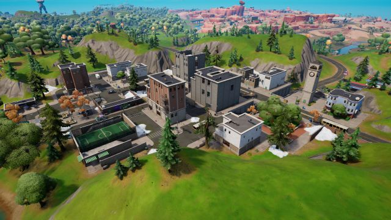
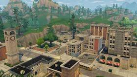
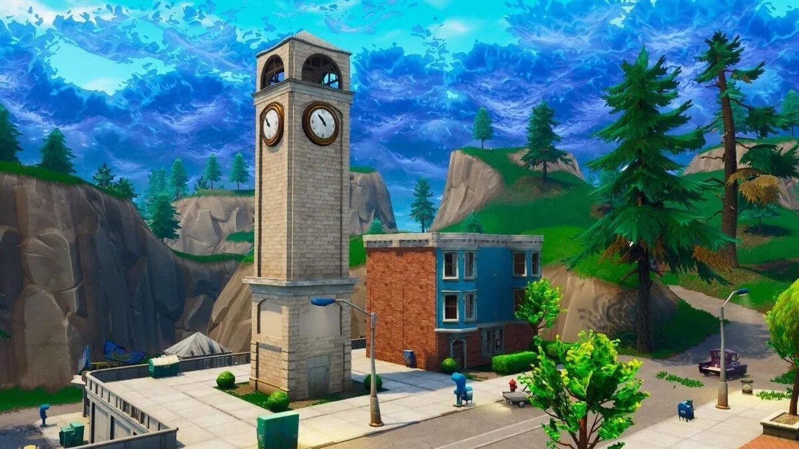

<!DOCTYPE HTML>
<html>
    <head>
        <title>Mi ciudad, Pisos Picados</title>
        <meta charset="utf-8">
    </head>
    <body>
        <h1>¿Que lugares verías? Vería la emblemática torre del reloj </h1>
        
        
¿Qué animales verias? Jabalis.Gallos y lobos.

        
        
¿Qué comida probarías? Pizza y jugos de sorbo

        
        
¿Si pudieras hacer el viaje perfecto, a dónde irías? Iría a la agencía de seguros 

        
    </body>
</html>
